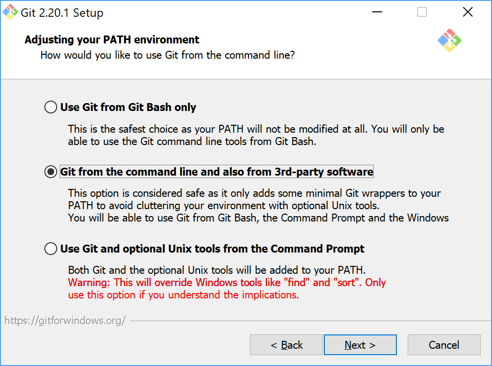
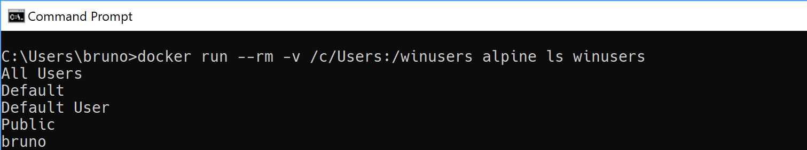

# Setting up a good development environment on Windows. ✨

## Goal

This article is about setting up Windows as a developer machine, with a preliminary discussion of when it's worthwhile to do so or not.

### Why Windows? (and why I quit MacOS)

A lot of developers scoff at Windows as a development machine, but I've never been entirely convinced of this assessment (more on this later). I have used Windows for most of my career, but I also gave a serious try to an alternative: MacOS, when I was doing backend Java. I used it for 9 months in one company where that was the default choice for the company's dev laptops.

I liked MacOS, it's probably the best OS for developers working on cross-platform stacks. I almost made the transition permanent, but one thing held me back - I am a PC gamer and I have a Windows desktop I use for gaming (and personal use). This means I had to work with both operating systems, one for work, one at home - and unfortunately the different keybindings for text editing were driving me nuts!! Things like the `Home` / `End`  key going to beginning/end of line in Windows, but beginning/end of text field in MacOS. `Ctrl` + `→` / `←` also works differently (Navigate word in Windows, Go to beginning/end of line in MacOS) - and so on for a few other text editing keybindings.

Whilst these keybindings could be configured in an IDE to be the same across both systems, in regular text fields in other apps (like a browser), that could not be done. Or at least, I haven't heard of any way. There were also other minor annoyances related to how the task bar and windowing manager behaves in a different way. These could be worked around with a few tools like [ubar](https://brawersoftware.com/products/ubar) (which I used heavily during my stint with MacOS), but the differences were always a source of tension. Using MacOS for gaming was not an option, so maybe it was best to just try using Windows in the dev machine. So that's what I went for.

### Is Windows good enough?

Like I said before, many developers would shun the idea of using Windows as a dev machine. Is there merit to this? I think fundamentally the answer depends on which tech stack you use. If for example, you work with an old school stack like LAMP, you wouldn't even have a choice but to use a Linux system (or MacOS).

If you work with a stack that originated in Linux / Unix, and has subsequently been ported to Windows, you usually have a choice... **but** often the experience tends to be a lot poorer on Windows. The tools assume a Unix environment, so the Windows port has to operate on a compatibility layer, making things more likely to break or be slow. Examples of this would be GNU Make based projects, or any language toolchain that heavily relies on shell scripting. It seems like stacks such as Ruby on Rails and Node.js also had very sub-par experience on Windows (I don't have extensive experience with any of those, but I've seen this mentioned often. For example, [reference here](https://onezero.medium.com/microsoft-failed-developers-and-now-it-has-a-plan-to-win-them-back-ecdafde5b20))

However, if you work with a stack that operates on proper **cross-platform** semantics by default, you are on much better grounds. Examples of this would be Java, or more generally any JVM language and its typical tools, especially build tools: Maven, Gradle, SBT, etc. All of these offer a cross-platform API that doesn't depend on POSIX semantics.

Even so, your app might itself depend on OS specific semantics, but if your project is fully containerized (as in, Docker), it shouldn't be an issue. Otherwise, better reach for that MacBook then! 😅 (or be happy with WSL, see note at end of article)

## The Setup

### Package Manager - Chocolatey

The first thing I would recommend installing in Windows is [Chocolatey](https://chocolatey.org/), the package manager for Windows. (yes, Windows has one!) Now you can install some common packages, if they are not installed already:

```
choco install 7zip
choco install Firefox
choco install notepadplusplus
choco install jdk11 -params 'static=false'
choco install intellijidea-community
choco install libreoffice-fresh
```

There are many more packages you can install and update using Chocolatey. Some packages have installation options that can be specified with command line parameters. However, some programs I recommend installing using the native installer instead of Chocolatey (Git being an example), since the interactive installer wizard might offer important options than are not available as Chocolatey command-line parameters.

### Git

Next, install [Git for Windows](https://gitforwindows.org/). Make sure you select "Git from the command line and also from 3rd-party software" during installation:

<div align="center">
<a><a/> <br/>
</div>

The goal will be to use git from a MSYS2 shell. Also, in other settings, I personally would recommend setting `core.autocrlf` to false.

Git for Windows will provide not only Git tooling but also Git Bash, a well packaged but limited POSIX environment. Some Windows developers would be content with just Git Bash - but we want to have a better environment than that - and there is a big limitation with Git-Bash: You can't install additional POSIX tools - so we will install MSYS2 and use that instead.

#### Why MSYS2 and not Cygwin?

Given the task of installing a POSIX environment in Windows, one has the choice of Cygwin or MSYS2 (which is a fork of Cygwin). So which one is best, what are the pros and cons of each? A first look at the [differences](https://github.com/msys2/msys2/wiki/How-does-MSYS2-differ-from-Cygwin) was not very clarifying, it mentions a lot of POSIX vagaries that I do not understand very well. However, the gist of that article seems to be:

* MSYS2 trades some compatibility for performance. MSYS2 does not use a POSIX compatibility layer like Cygwin, but instead tries to use native Windows APIs (for most tools, but not necessarily all). Still, this means better performance when using MSYS2 programs (at the expense of less packages available than Cygwin). ([reference 1](https://www.booleanworld.com/get-unix-linux-environment-windows-msys2/), [reference 2](https://news.ycombinator.com/item?id=15904553))
* MSYS2 converts Unix paths to Windows paths, so you can do stuff like:

  ```
  start notepad++ /c/Users/John/file.txt 
  ```
  (I wish Windows would provide this API natively!!)

Given all this, my intuition is that MSYS2 is the preferable choice. (also since, Git for Windows 2.x is [based on MSYS2](https://stackoverflow.com/a/35099458/393898))

### MSYS2

Follow the [MSYS2 installation instructions](https://www.msys2.org/).
Alternatively you can also use Chocolatey which should take care of all the steps:

```
➤ choco install msys2 --params "/InstallDir=C:/msys64"
```

#### Configure home directory:

By default MSYS2 will use `C:/msys64/home/$USER` as your home directory. Git for Windows however (and possibly other tools/libraries installed outside of MSYS2) will look in `C:/Users/$USER` which is the standard Windows home location. So to avoid this discrepancy, go to you MSYS2 installation directory, open `/etc/nsswitch.conf` and modify the `db_home` line to add a `windows` value before `cygwin`. It should end up looking like this:
```
db_home: windows cygwin desc
```
This will cause MSYS2 to look for user files under `C:/Users/$USER` too ([reference](https://stackoverflow.com/a/38878680/393898)).

#### Replace Bash:

Use of Bash is prolific among developers, but, if you stop and think about it, Bash is a fairly antiquated tool. There are better, more modern alternatives out there: Fish, IPython, ZSH, and so on.

So I wanted a bash replacement, but there were many options and no clear winner. To narrow things down, I would recommend going with a shell with a main focus on the interactive shell user experience, not so much the programming language (see [reference](https://ilya-sher.org/2016/05/26/fundamental-flaws-of-bash-and-its-alternatives/) for more information). I don't normally write shell scripts either way, and if I did, I'd probably go with a statically typed system like the [Ammonite shell](https://ammonite.io/#Ammonite-Shell)).
So, of all those choices I went with [Fish](https://fishshell.com/). I also briefly tried ZSH and Oh-My-Zsh, but the recommend way of using it is with a set of plugins and extensions (Oh-My-Zsh) installed on top of the base package! That did not inspire much confidence in me that it was a fresh, well designed and maintained project. Rather, it looked more like [second-system syndrome](https://en.wikipedia.org/wiki/Second-system_effect). Plus, it looks like ZSH/Oh-My-Zsh is very slow on Windows, likely due to fact that it uses a lot of bash/unix scripting. Fish I found to be significantly faster, and a lot cleaner to install and configure.

To install, just run from MSYS2:


```
➤ pacman -S fish
```

I've been using it for a while and I find it much nicer than Bash (better completion, more features, etc.).

#### Configure shell launcher:

We will finalize MSYS2 setup by configure the shell launchers. Locate mingw64.ini in MSYS2 installation dir and add/uncomment these lines:

```
CHERE_INVOKING=1
MSYS2_PATH_TYPE=inherit
```

```
SHELL=/usr/bin/fish
```

The MSYS2_PATH_TYPE setting will make MSYS2 shell inherit your standard Windows PATH environment, so that you can use the tools there (Git, for example). CHERE_INVOKING will have the shell remain in the directory where it was invoked (this will be useful later in Windows Explorer menu shortcuts).

#### Why not use Git installed from MSYS2's pacman?

Good question. I was looking this up to see if it was possible and if it would be worthwhile to do. I found this link: [https://github.com/git-for-windows/git/wiki/Install-inside-MSYS2-proper](https://github.com/git-for-windows/git/wiki/Install-inside-MSYS2-proper) from Git for Windows developers that says it's possible but that you have to modify msys2-runtime to have full functionality. Since that is not a clean solution and otherwise there seems to be no advantage to this approach (as far as I can tell), it seems like the better option is to just use the Git-for-Windows package.

#### Some problems with Git and cloning from SSH repos.

I did find one problem with using Git-for-Windows from MSYS2. If you try to clone a repo over SSH, and you have a passphrase for your SSH key, [the clone will fail](https://groups.google.com/forum/?utm_medium=email&utm_source=footer#!msg/git-for-windows/UNGN0FwI8Jo/le1ifC5VDgAJ) (probably due to Git not being able to interactively ask for password). It works fine from Git-Bash tho.

Interestingly if you install openssh on MSYS (pacman -S openssh), **\*and\*** you call Git using it's full pathname (`/c/Program\\ Files/Git/mingw64/bin/git`) then it will try to use openssh from MSYS2, and it will be able to ask for passphrase and thus clone successfully. But only if you use the full pathname - if you just use simple "git", it will use the ssh from Git-for-Windows, and will fail to clone. I am mystified as to why! But I was not that bothered to find out. It's one of those vagaries of clunky UNIX in Windows integration (the kind of things that make many developers prefer using MacOS or Linux). Either way I can always workaround it by cloning from an IDE, cloning from HTTPS URL, or just clone in Git-Bash (cloning is not that frequent operation anyway, so I'm not that bothered by this one).

Still, as a workaround, I created an alias so that the short "git" command would use full pathname. To do this create a file `~/.config/fish/functions/git.fish `and add this line:

```
alias git="/c/Program\\ Files/Git/mingw64/bin/git"
```

Of course, adjust paths above if you installed Git in a different location.

### Explorer context menu shortcuts.

It's quite handy to have context menu shortcuts in Windows Explorer to open the Unix shells. Save this to a .reg file and import it to the registry by double-clicking it:

```
Windows Registry Editor Version 5.00

\[HKEY_CLASSES_ROOT\\Directory\\shell\\mingw64_sh\]
@="Open Shell"
"Icon"="C:\\\\msys64\\\\mingw64.exe"

\[HKEY_CLASSES_ROOT\\Directory\\shell\\mingw64_sh\\command\]
@="C:\\\\msys64\\\\mingw64.exe"

<br />

\[HKEY_CLASSES_ROOT\\Directory\\Background\\shell\\mingw64_sh\]
@="Open Shell"
"Icon"="C:\\\\msys64\\\\mingw64.exe"

\[HKEY_CLASSES_ROOT\\Directory\\Background\\shell\\mingw64_sh\\command\]
@="C:\\\\msys64\\\\mingw64.exe"
```

Note, the difference between `Directory\\shell` and `Directory\\Background\\shell` is that the former is for the context menu when you right click a folder icon, the later is for when you click the background (no icon) of an explorer Window.

### Docker

Docker has become a stable of backend application developers, so let's install [Docker for Windows](https://docs.docker.com/docker-for-windows/). BTW, Docker a nice example of a tool making an effort to have the Windows version be a first-class citizen. That said, there are a few oddities when using Docker from MSYS2, two in particular that we will address:

1) If you run a docker container in interactive mode (-it option) you will get this error:

```
➤ docker run -it --rm alpine
the input device is not a TTY. If you are using mintty, try prefixing the command with 'winpty'
```

The solution, as the error message states, is to run it through winpty:

```
winpty docker run -it --rm alpine
```

The reason for this, is that when running in interactive mode, Docker (and some other non-MSYS2 console applications) expect a **\*Windows\*** interactive console to be present. Winpty creates a hidden one in the background and adapts keyboard input and output to the MSYS2 shell.

2) Second issue is path conversion. Consider this:

```
➤ docker run --rm -v 'c:\\Users':/winusers alpine ls winusers
```

This will start the alpine image and map the path /winusers in the container to the contents of `c:\\Users` in Windows machine. Then it lists the content of that folder. So far so, good, but wouldn't it be nice to use MSYS2 paths (`/c/Users`) instead of Windows ones? If you try that you get an error:

```
➤ docker run --rm -v /c/Users:/winusers alpine ls winusers
C:\\Program Files\\Docker\\Docker\\Resources\\bin\\docker.exe: Error response from daemon: Mount denied:
The source path "C:/Users;C"
doesn't exist and is not known to Docker.
```

This is because MSYS2 detects that docker is not a MSYS2 program, so it tries to convert MSYS2/Cygwin paths to Windows ones. Unfortunately it thinks `/c/Users:/winusers` is one single Windows path and tries to convert it, which is clearly erroneous, and it gets converted into something weird.

It is also unnecessary since Docker is smart enough to do the conversion itself. That is, Docker understands Unix paths such as `/C/foo` and interprets it correctly as a windows path (`C:/foo`). You can see this in action by running `docker run --rm -v /c/Users:/winusers alpine ls winusers` in a Windows prompt. It will work fine:

<div align="center">
<a><a/> <br/>
</div>

So what is the solution here? Fortunately we can disable this MSYS2 path conversion with the MSYS2_ARG_CONV_EXCL env var ([reference](https://github.com/msys2/msys2/wiki/Porting#filesystem-namespaces)). So for example here we are using Unix paths (/c/Users) and it works:

```
➤ env MSYS2_ARG_CONV_EXCL="\*" docker run --rm -v /c/Users:/winusers alpine ls winusers
```

We don't want to set the environment var `MSYS2_ARG_CONV_EXCL=\*` globally as this would break other things. Only when running specific commands like Docker. So we will put that behind a shell alias.

#### Docker - putting both things together:

We are now ready to put these two options (MSYS2_ARG_CONV_EXCL and winpty) under a shell alias, but there is an additional complication. They don't both work together!😖 The problem is that the winpty packaged in MSYS2 has its own path conversion, and it can't be disabled - it ignores MSYS2_ARG_CONV_EXCL. (more details [here](https://github.com/msys2/MSYS2-packages/issues/411))

So the workaround I did, as suggested [here](https://github.com/msys2/MSYS2-packages/issues/411#issuecomment-372585320), was to download upstream binaries of winpty ( [https://github.com/rprichard/winpty/releases/tag/0.4.3](https://github.com/rprichard/winpty/releases/tag/0.4.3)) and use those. For cleanliness, I unpacked those in a separate directory, in my case: `/usr/local/winpty-upstream`

So, in the final setup we will create two Docker aliases. First one: Create a file `~/.config/fish/functions/docker.fish `with the content:

```
alias docker='env MSYS2_ARG_CONV_EXCL="\*" docker'
```

This will be the most common alias, which disables MSYS2 path conversion and lets Docker do its own thing. But it won't work for interactive mode. For that, we setup the second alias. Create a file `~/.config/fish/functions/dockeri.fish `with the content:

```
alias dockeri='env MSYS2_ARG_CONV_EXCL="\*" /usr/local/winpty-upstream/bin/winpty docker'
```

This should take care of things. Use dockeri whenever you need a Docker interactive terminal (this alias uses the winpty we downloaded). Now, why not use dockeri all the time and just make it the default alias? Now that's certainly a possibility, but I wonder if using winpty all the time will not bring up some other obscure incompatibilities. I haven't used this setup long enough to find out, so for now I will leave it with both aliases. Maybe to be revised it in the future.

### TODO:

I wanted to add a section about installing Kubernetes, but I still didn't have the time to explore it in more depth. And the article was getting long. I might leave it for a follow-up article.

### WSL - Windows Subsystem for Linux ?

Now, it's worth mentioning an alternative to Cygwin that is WSL. WSL is promising in that you get access to a proper Linux distribution - it's an environment where you don't have compatibility or performance issues like you have with Cygwin... However, that is only because once inside the Linux system, you don't have full access to the Windows system - you can access some folders and files if you configure some mappings, but you can't run Windows apps for example.

The robust Linux compatibility of WSL is at the cost of it being isolated from the Windows side.
However, for me the appeal of having a Unix shell in Windows is to be able to access all of the Windows system, i.e., to be able to run Windows native apps, as well as Unix/Cygwin ones in the same shell.

WSL is not that unfortunately, it's more like a Linux Docker image, albeit but more performant (nearly as performant as native Linux). But still restricted that you only have access to the Linux side of things. I wonder if there is a chance that might change in the future. If so, it will definitely be worth to revisit it.

### The one thing I missed from MacOS:

To be honest, one thing I missed from MacOS was the ability to have color emojis in the shell prompt! 😍 A bit silly, but I liked it.

I tried to setup a similar thing in Windows, but it was just not possible. Although Fish and other shells can be configured with Unicode support, the Windows native fonts do not support color symbols. It will render emojis, but in two tones only, which look ugly. Installing additional fonts will not work because it's the Windows font system itself that does not support color in such way, not the fonts. This might change in future, but for now, it can't be done.
